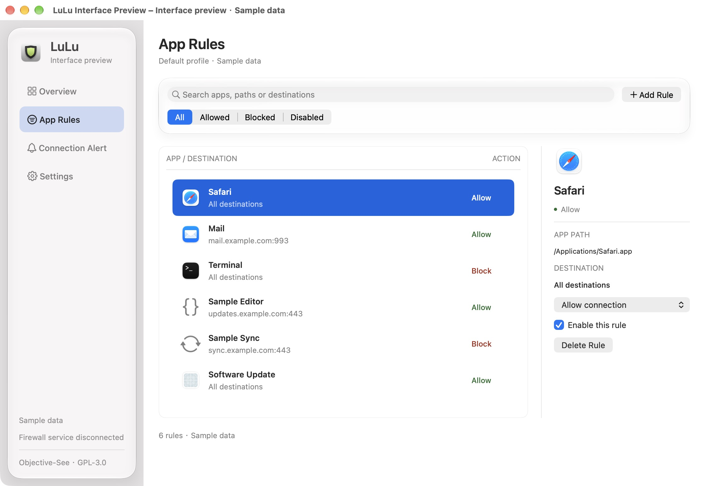

# LuLu Interface Preview

An independent, native AppKit / Objective-C design prototype for LuLu. Runs on macOS 11 or later; building requires Apple's command-line developer tools with the macOS 26 SDK or later. The production app retains its macOS 10.15 deployment target.

```sh
./script/build_and_run.sh           # Traditional Chinese
./script/build_and_run.sh --english # English
./script/build_and_run.sh --english --light # English, light appearance
./script/test_preview.sh
```

The bundle is created at `outputs/LuLu Interface Preview.app`, with identifier `org.local.lulu.interface-preview`. The Codex Run action starts this preview.



## Experience

- Overview: disconnected service status, sample rule counts and quick navigation.
- App rules (the opening page): search by name, path or destination; filter by action or disabled status; inspect, add, change, disable and delete sample rules. Undo / redo use Command-Z / Shift-Command-Z.
- Connection alert: app, destination, scope, duration, expandable details and a visible sample decision. Custom duration accepts 1–1440 whole minutes.
- Settings: grouped, labelled native switches. State remains in memory while the preview is open.
- Command-1 through Command-4 navigate between pages. All form fields and switches have accessibility labels. System controls, semantic text colors and Auto Layout support light and dark appearances.

## Scope

This is a UI prototype with six fictitious/sample rule records. It does not connect to a firewall service, inspect live network activity, create firewall rules, install a system extension or change system settings. The setting switches and alert decisions modify preview state only. Alert decisions do not enforce networking or create timed rules. Quitting resets all sample state.

The production UI changes are in the existing Rules, Preferences and Alert controllers and their NIBs. The sidebar and overview in this prototype are separate design work; they are not yet integrated into the production app. Existing production features such as profiles, lists, signing inspection and VirusTotal remain in the original controllers.

## Design

The sidebar and search controls use native `NSGlassEffectView` on macOS 26 or later, with `NSVisualEffectView` on older systems and an opaque surface when Reduce Transparency is enabled at creation. Content uses system colors, native app icons, compact rule rows and a separate inspector. The overview shows service state and rule totals; settings use grouped rows. Selected rule actions adopt the system selection text color.

The window uses 23 pt page titles, 13–16 pt primary labels and 11–12 pt supporting details. Allow and block actions have explicit text labels as well as color.

Search includes an explicit empty state. Invalid forms keep their input and show inline errors. Decision buttons have no default Return action. The prototype contains no artificial loading screen or continuous animation.

## Provenance and license

Based on [Objective-See/LuLu](https://github.com/objective-see/LuLu), commit `7d2669ed32e5b195d5863dc9695441d3301ba7b0`, marketing version 4.5.1. LuLu's original copyright and [GPL-3.0 license](../LICENSE.md) are retained. This modified interface prototype was added on 2026-09-29 and is also distributed under GPL-3.0. It is not an official Objective-See release.
